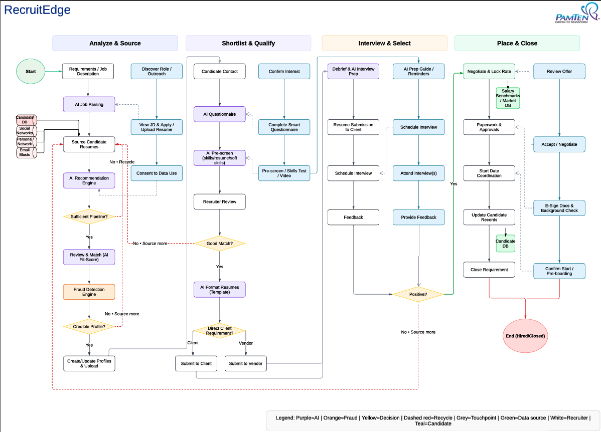

# RecruitEdge – AI Staffing Portal (Case Study)

## Project Summary
RecruitEdge is an AI-enabled staffing platform built to streamline resume evaluation, candidate-job matching, and fraud detection for staffing and HR teams.

## My Role
Business Analyst

## Key Responsibilities
- Translated business needs into clear requirements and success criteria for modules including ATS, Resume Intelligence, and Fraud Detection.
- Created workflow diagrams and process maps to define and optimize the end-to-end recruitment lifecycle.
- Led requirement workshops (JAD), sprint planning, backlog grooming, and stakeholder reviews.
- Coordinated UAT planning and execution, including test case design and defect triage using Jira.

## Achievements & Impact
- Reduced manual screening time by 35% through automation of candidate evaluation.
- Improved fraud detection accuracy by 25% using structured validation rules and AI-driven checks.
- Enhanced decision visibility for leadership by defining analytics KPIs and reporting views.

## Tools & Technologies
Power BI, SQL Server, Spring Boot, Azure DevOps, Google Cloud Storage, Jira, Lucidchart, MS Visio

*Note: Detailed BRDs/FRDs and proprietary materials are not included due to confidentiality.*

